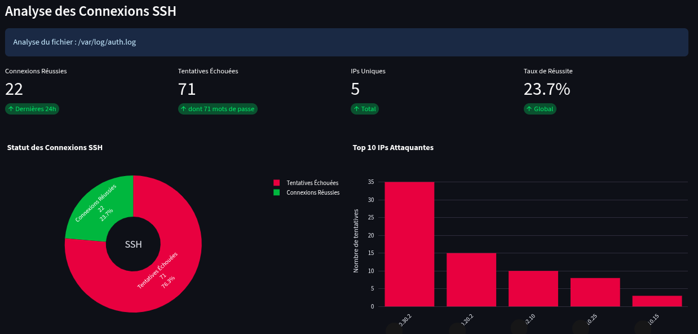

# Fail2Shield Dashboard

Un dashboard web simple pour surveiller et gérer Fail2ban.

## Contexte du Développement

Cette application a été développée pour simplifier la gestion de Fail2ban via une interface web moderne. Au lieu d'utiliser les lignes de commande, vous pouvez maintenant :

- Voir les IPs bannies en temps réel
- Bannir/débannir des IPs en un clic
- Visualiser les attaques par pays avec des graphiques
- Modifier la configuration des jails facilement

## Installation Rapide

```bash
# 1. Télécharger les fichiers
git clone https://github.com/anis-metref/fail2Shield.git
cd fail2Shield

# 2. Lancer l'application
sudo ./run.sh
```

## Utilisation

1. Ouvrir votre navigateur : `http://localhost:8501`
2. L'application se lance automatiquement
3. Si Fail2ban n'est pas installé, suivre les instructions affichées




## Fonctionnalités

- **Dashboard** : Vue d'ensemble des menaces
- **Gestion IPs** : Bannir/débannir facilement
- **Cartes géographiques** : Voir d'où viennent les attaques
- **Configuration** : Modifier les paramètres des jails
- **Logs** : Analyser l'activité de sécurité

## Prérequis

- Python 3.8+
- Fail2ban installé + iptables
- Permissions sudo (pour accès complet)

## Support

L'application fonctionne sur Ubuntu, Debian, CentOS, Fedora et autres distributions Linux.

---

**Fail2Shield Dashboard** - Sécurité simplifiée pour tous.
